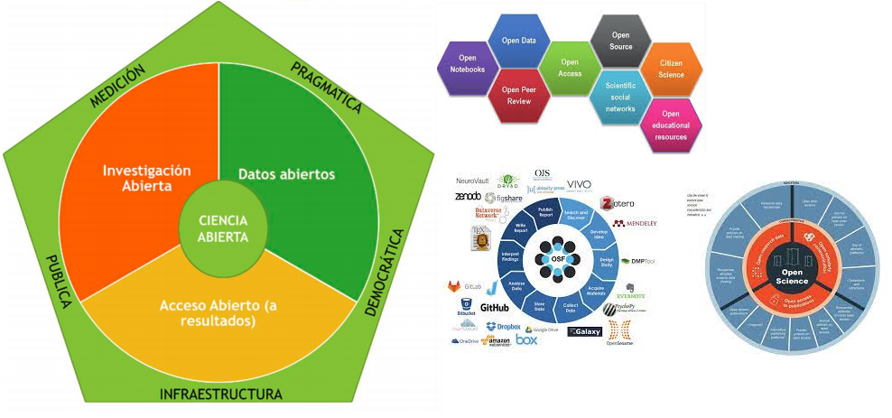
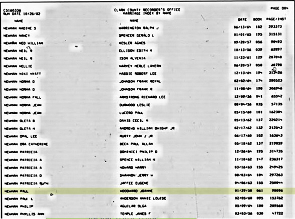
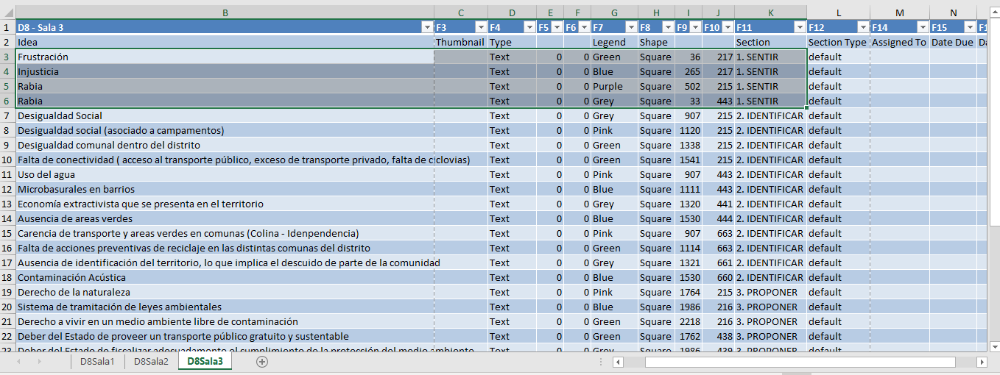

class: inverse, bottom, right

```{r, include=FALSE,echo=FALSE,results='hide'}
#install.packages("pagedown")
#pagedown::chrome_print("Presentacion.html",output="Presentacion.pdf")
#xaringan :: inf_mr ()
#xaringan::summon_remark()
```


```{r setup, include=FALSE, cache = FALSE}
require("knitr")
options(htmltools.dir.version = FALSE)
pacman::p_load(RefManageR)
```

```{r eval=FALSE, echo=FALSE}
# Correr esta linea para ejecutar
rmarkdown::render('xaringan::moon_reader')
```

<!---
About macros.js: permite escalar las imágenes como [:scale 50%](path to image), hay si que grabar ese archivo js en el directorio.
.pull-left[<images/Conocimiento cívico.png>] 
.pull-right[<images/Conocimiento cívico_graf.png>]

--->

# __Ciencia Abierta en ciencias sociales__
# Almacenamiento de datos:
## *Razones, protocolos y experiencias*
<br>
<hr>


### Francisco Meneses Rivas, *Universidad de Chile*

<br>

.small[Profesor de cátedra: Juan Carlos Castillo]

---

layout: true
class: animated, fadeIn

---
class: inverse, middle, center, slideInRight

# ¿Qué son datos abiertos?
---
## ¿A qué nos referimos con datos abiertos?

* Existen distintas divisiones para señalar las etapas. Todas aluden a los datos 

.center[]
 

---

## ¿A qué nos referimos con datos abiertos?
 
 
.pull-left[

* Dejar al libre acceso. 
 
* Facilitar el uso a terceros. 
 
   *    Buenos ejemplos 
   
        *   [Dataverse COES](https://dataverse.harvard.edu/dataset.xhtml?persistentId=doi:10.7910/DVN/0KIRBJ) /  [Datos encuesta CEP](https://www.cepchile.cl/encuestaCEP) / [Datos Uchile](https://datos.uchile.cl/)]

.pull-right[

        
]

 
???

 Ejemplos de las dificultades para conseguir datos


 Esto implica formatos utilizables

---
# Intentar conseguir datos actualmente en ciencias sociales...


---
class: inverse, middle, center, slideInRight

# ¿Por qué deberíamos abrir los datos?
---

## Razones para compartir "nuestros" datos
 
* Democratizar el conocimiento
    * Si se financia públicamente debe ser de acceso público
    * Alto costo de producción
    
* Logra una ciencia de mejor calidad
    * Permite el escrutinio público, es la piedra basal de la reproducibilidad:  El caso de Newman y Solt
    * Fomenta la cooperación entre investigadores y con ello la innovación (ej. mi tesis)
    
* Permite estudios históricos, ya que resguarda información para futuras generaciones
    * "Cambios en las posiciones políticas en los últimos 200 años"
    
* Incentivos personales: Visibilidad e impacto Piwowar and Vision (2013) 
    
---
## Crear datos, sin curatoría ni publicación


---
class: inverse, middle, center, slideInRight

# ¿Cuáles son los estándares para compartir mis datos? 
---

### Algunos estándares promovidos internacionalmente

En general, la idea es estandarizar los criterios para la apertura de datos, con el objetivo de que sea más fácil que cualquiera trabaje con ellos.
  
  * FAIR (Encontrables, Accesibles, Interoperables, Reutilizables)
  * Acceso abierto ICSU
  * Planes de manejo de datos (DMP) de la comisión europea.
  * OAIS Managament Research Data

---

# Principios FAIR

El objetivo es que sean fáciles de utilizar por investigadores y mediante inteligencia artificial.

.pull-left[

* Encontrables: Identificador, Metadatos, Motor de búsqueda

* Accesibles: Direcciones web accesibles (http)

* Interoperables: Variedad de Software (No-Propietario, Ñ) y tesauros (eric)

* Reutilizables: Amplios metadatos, licencia, datos ordenados

]
.pull-right[

        
]

---
# Datos ordenados

El objetivo de tidyr es ayudarte a crear datos ordenados. Los datos ordenados son datos donde: 

*	Cada columna es una variable.

*	Cada fila es una observación.

*	Cada celda es un valor único.

---

# Ejemplo base desordenada

Tiene 4 casos por hoja, la variable se indica en como valor de la columna F11 (SENTIR, IDENTIFICAR, PROPONER). De la fila 3 a la 6 en la primera columna están los sentimientos de cada encuestado sobre un tema. Desde el 7 están los sentimientos de la mesa en general (Discusión entre los cuatro)

¿Cómo debería ser esta base en formato ordenado?



---

class: inverse, middle, center, slideInRight

# Muchas gracias por su atención!
---

.pull-left[

### Sobre almacenamiento te datos

[Como publicar datos, LISA](https://lisa-coes.netlify.app/02componentes/)

[Información sobre Datos abiertos](https://franciscomeneses.github.io/CADIS/index.html)

###Ejemplos de repositorios de datos

[Datos de investigación UdeChile](https://datos.uchile.cl/) 

[Datos COES en Dataverse](https://dataverse.harvard.edu/dataverse/coes_data_repository) 

[Datos CEP](https://www.cepchile.cl/encuestaCEP)

]


###Algunas herramientas 

[tidyr para ordenar datos en R](https://tidyr.tidyverse.org/index.html )

[tidyr y tidyverse](https://brianward1428.medium.com/introduction-to-tidyverse-7b3dbf2337d5)

[Libros de codigo con sjPlot::view_df()](http://www.strengejacke.de/sjPlot/reference/view_df.html#examples)

[De PDF a Excel](https://www.ilovepdf.com/es/pdf_a_excel) 
[Tesauro ERIC](https://eric.ed.gov/ tesauro) 

[Datos cualitativos abiertos](https://data.qdr.syr.edu/) 


